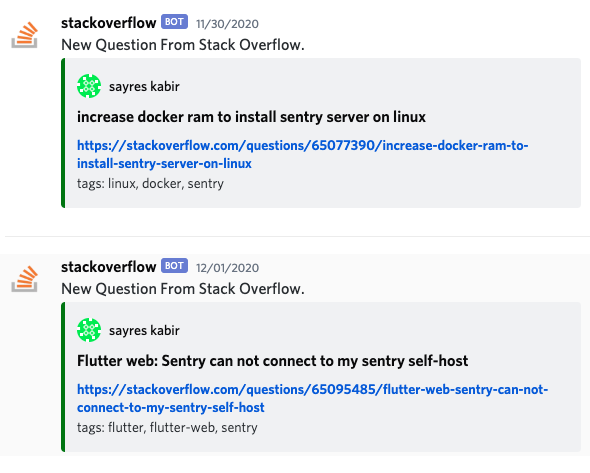

# oxide overflow

[](https://github.com/bruno-garcia/oxideoverflow/actions?query=branch%3Amain) 


A worker that takes new posts from StackOverflow, of a certain tag, and writes it to a Discord channel.



## On Docker Hub

https://hub.docker.com/r/brunogarcia/oxideoverflow/tags

### Sentry

This project uses [Sentry](https://sentry.io) to track errors and crashes. When a docker image is built, in the build phase of the [Dockerfile](Dockerfile)
the debug files are uploaded to Sentry in order to get the proper line numbers of crashes. That's done with `sentry-cli` and requires a [Sentry auth key](https://docs.sentry.io/product/cli/configuration/#to-authenticate-manually). The container will initialize Sentry if a [DSN](https://docs.sentry.io/product/sentry-basics/dsn-explainer/) is defined via environment variable `SENTRY_DSN`. That's used by the Sentry SDK in the process to knows what Sentry instance ([your own](https://github.com/getsentry/onpremise), or [sentry.io](https://sentry.io/pricing/)) and which project within it to send the error information to.

### Build with Docker

```sh
docker build -t oxideoverflow \
    --build-arg SENTRY_RELEASE=1.0 \
    --build-arg SENTRY_AUTH_TOKEN=your-sentry-auth-token \
    --build-arg SENTRY_ORG=your-sentry-project \
    --build-arg SENTRY_PROJECT=oxideoverflow \
    .
```

### Running

You can run the container by providing a few arguments to it. The parameters are described below.

At a minimum you need `OXIDEOVERFLOW_TAG` and `OXIDEOVERFLOW_DISCORD_URL`:

```sh
docker run --rm \
    --env OXIDEOVERFLOW_TAG=sentry \
    --env OXIDEOVERFLOW_DISCORD_URL=https://discord.com/api/webhooks/your-personal-url \
    oxideoverflow
```

Where `sentry` and `https://discord.com/api/webhooks/your-personal-url` would be replaced with the information relevant to you.

Alternatively you can provide more information:

```sh
docker run --rm --env SENTRY_ENVIRONMENT=test \
    --env SENTRY_RELEASE=1.0 \
    --env SENTRY_DSN=https://0fe0d16e158146279a751bbf675f2610@o117736.ingest.sentry.io/5536978 \
    --env OXIDEOVERFLOW_TAG=sentry \
    --env OXIDEOVERFLOW_STACKOVERFLOW_KEY='my-token' \
    oxideoverflow
```

#### Discord Webhook

`OXIDEOVERFLOW_DISCORD_URL` - [The URL you get from your Discord server](https://support.discord.com/hc/en-us/articles/228383668-Intro-to-Webhooks), that tells _oxideoverflow_ which channel to send the question to.

#### StackOverflow API key

`OXIDEOVERFLOW_STACKOVERFLOW_KEY` - To be able to hit the StackOverflow API more often, an API key can optionally be used. That increases the rate limite from the default 1000 per 24 hours to 10000 for that time range. You can register for an API token by [creating a Stack App](https://stackapps.com/apps/oauth/register).

#### StackOverflow tag

`OXIDEOVERFLOW_TAG` - Which tag you want to monitor for questions on StackOverflow.

#### Sentry Release and Environment

`SENTRY_ENVIRONMENT` - The environment. If nothing is passed, it's assume _prodution_.  
`SENTRY_RELEASE` - The release name. For example 1.0 or a git SHA.
